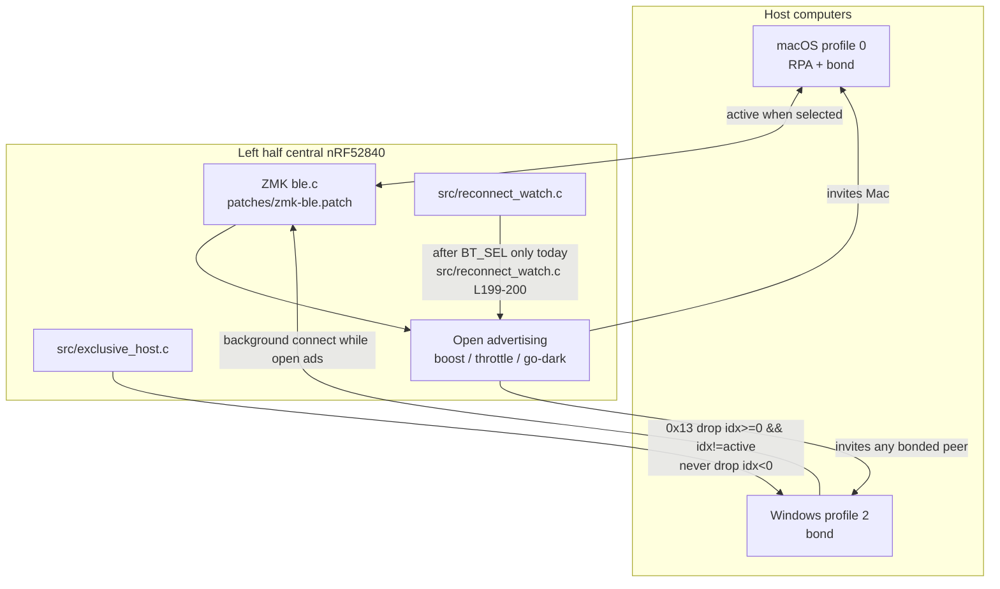
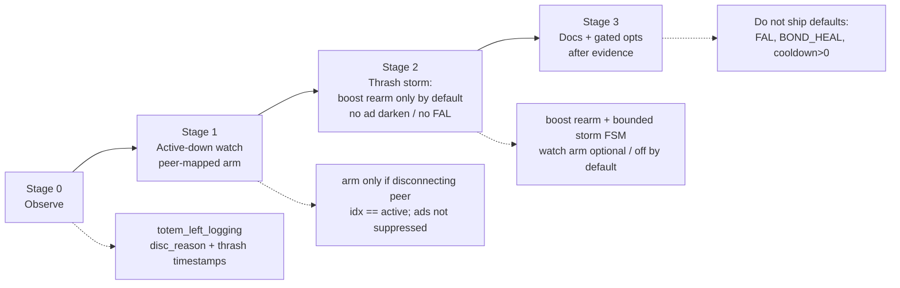
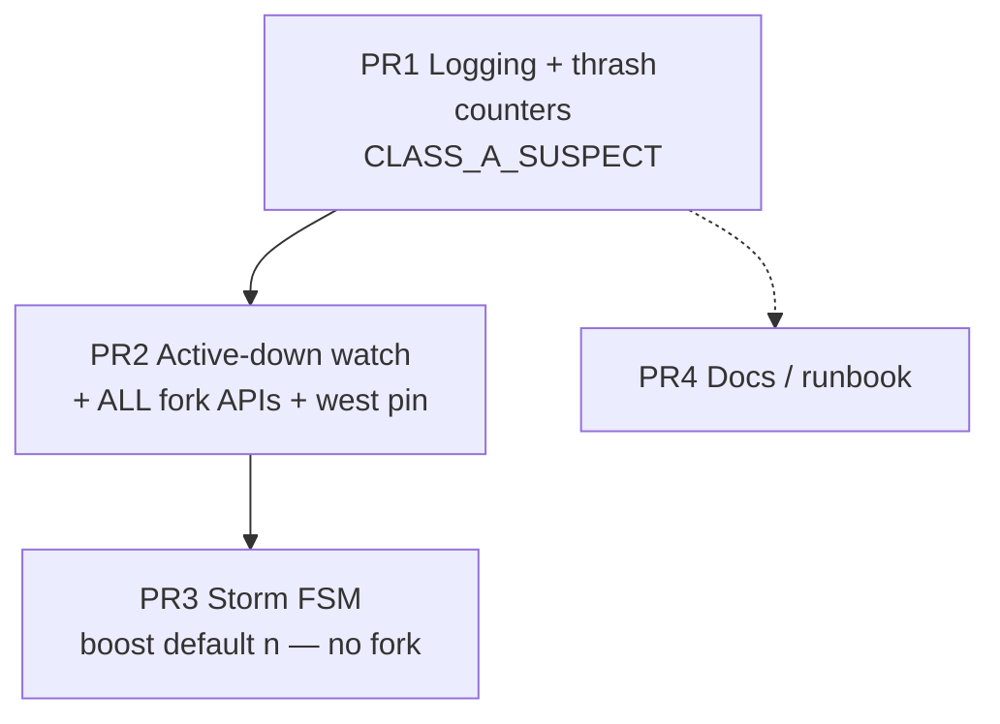

# Totem Dual-Host BLE Firmware Hardening (Next Iteration)

| Field | Value |
|---|---|
| **Document** | Totem dual-host BLE firmware hardening |
| **Author** | _(TBD)_ |
| **Date** | 2026-07-20 |
| **Status** | Draft (revision 3 — boost restart + light-step wiring) |
| **Repo** | `/Users/admin/totem-zmk-config` |
| **Hardware** | GEIGEIGEIST Totem split, XIAO BLE (nRF52840) |
| **Hosts** | macOS = profile 0, Windows = profile 2 |
| **Fork pin (baseline)** | `rleyvasal/zmk@739d22b8931d0a39c90a161b0779af98614bbbac` (`config/west.yml` today) |

---

## Overview

After multi-hour dual-host use, the keyboard can enter a state where **profile 0 (macOS) appears greyed out / not connected with no typing**, while **Windows (profile 2) flaps connected/disconnected**—even though profile 0 remains selected and the bond is still good. On 2026-07-20 this was recovered by **host-initiated Mac Bluetooth off → wait 5s → on**, without Forget or re-pair.

**Inferred classification (no serial capture yet):** not pure bond-rot (Class A). Best current model is a **Class B thrash + Class C host-stack wedge** composite: selected host is down, open advertising invites the background host, exclusive-host correctly evicts Windows (`0x13`) in a loop, and the Mac Bluetooth stack needs a host-side nudge to rejoin. Stage 0 logging is mandatory before we treat this model as proven.

Firmware cannot re-subscribe HID CCC on macOS or unwedge the OS Bluetooth controller. It **can**:

- Produce logs that distinguish Classes A–D
- Arm soft recovery when the **active** host disconnects mid-session (without breaking idle go-dark)
- On thrash storms, **temporarily densify advertising** (boost) so a connectable Mac has a better chance to win—**without** pausing ads, FAL, or “refuse-only” that needs accept-list

This document proposes an evidence-driven plan in **2–4 small PRs**: observe first → active-down watch → optional storm boost (default **off** until one capture) → docs. No re-enabling FAL, bond-heal, or non-zero evict advertising cooldown.

---

## Background & Motivation

### Current dual-host architecture



| Component | Path | Role today |
|---|---|---|
| Exclusive host | `src/exclusive_host.c` | Fast-evict known non-active profiles (`idx >= 0 && idx != active`) immediately, no L2 wait; **never** drop `idx < 0` (RPA/pairing). Note: older `Kconfig` help / DEBUGGING-NOTES “security-aware wait” text is **stale** relative to current code. |
| Reconnect watch | `src/reconnect_watch.c` | After `BT_SEL` only (`ZMK_SUBSCRIPTION` → `zmk_ble_active_profile_changed`, ~L199–200): reselect/kick ads → force-evict → soft-drop zombie active-map only; never clears bonds. `reconnect_watch_arm` is **file-static** (~L175). `BT_CONN_CB` only **cancels** on connect/security L2—no `.disconnected` today. |
| BLE patch | `patches/zmk-ble.patch` | Throttle, idle go-dark, adv boost, reselect, open-adv retry, RPA profile match, optional FAL (off), EVICT cooldown forced 0. `totem_adv_boost_arm` is static. |
| Config knobs | `config/totem.conf`, `Kconfig` | Feature flags and timers |
| Diagnostic image | `build.yaml` → `totem_left_logging` | USB serial for disconnect reasons (**HID→USB + radio contention**—do not judge thrash timing on this image) |
| History | `DEBUGGING-NOTES.md` | Local design record of attempts/failures |

**Shipped defaults as in `config/totem.conf` (not raw Kconfig defaults):**

- `CONFIG_TOTEM_EXCLUSIVE_HOST=y`, reason `0x13`
- `CONFIG_TOTEM_EVICT_ADV_COOLDOWN_MS=0` (critical: non-zero starves selected host)
- `CONFIG_TOTEM_BOND_HEAL=n`, `CONFIG_TOTEM_ACTIVE_ADV_FILTER=n`
- `CONFIG_TOTEM_RECONNECT_WATCH=y` / `_SEC=8` (armed only on profile change)
- `CONFIG_TOTEM_ADV_BOOST=y` / `_SEC=20` (Kconfig default is 12; conf overrides to 20)
- Throttle 5 min, idle disconnect 20 min
- `CONFIG_BT_SMP_ALLOW_UNAUTH_OVERWRITE=y`, `CONFIG_BT_GATT_ENFORCE_SUBSCRIPTION=n`, `CONFIG_ZMK_SLEEP=n`
- Fork pin `739d22b8…` in `config/west.yml` (baseline before this iteration’s fork PR)

### Pain points from the 2026-07-20 field incident

| Observation | Implication |
|---|---|
| Mac greyed out, no typing; profile 0 selected | Selected host not on the link |
| Windows flapping while profile 0 selected | Open ads + exclusive-host thrash (Class B), expected when active is down |
| Switch to profile 2 → Windows typed normally | Windows bond and keyboard stack OK for profile 2 |
| Worked days, including after 8–10 h absence; failed after ~3–4 h today | Not a cold-boot / throttle-timeout-only bug; multi-hour dual-host stress |
| Mac BT off/on recovered; **no re-pair** | Bond OK → **Class C** (host stack wedge), not Class A bond rot |
| Full re-pair not required | Must **not** auto-clear bonds or treat as healable auth failure |
| **No serial `disc_reason` histogram** | Classification is recovery-mode inference until Stage 0 capture |

This differs from **2026-07-16/17 bond rot**, where Forget + `BT_CLR` + re-pair was required. Same surface symptoms (grey Mac + Win flap) can be Class A **or** Class C; only recovery mode and disconnect reason codes distinguish them.

### Hard constraints (do not re-propose as primary path)

| Attempt | Result | Consequence for this design |
|---|---|---|
| Accept-list / FILTER_CONN (FAL) | Broke Mac profile switch; 2026-07 FAL → no advertising on this HW | Keep `ACTIVE_ADV_FILTER=n`; re-test only under explicit criteria |
| Drop-by-address modules | Rejected legit Mac RPA | Never identify host solely by raw address |
| Disconnect-on-profile-switch inside `prof_select` | macOS connected-but-mute (CCC) | Evict only post-switch / `connected` callback paths |
| Non-zero `EVICT_ADV_COOLDOWN_MS` | Starved selected host during thrash (2026-07-17) | Cooldown stays 0; thrash mitigation must **not** darken ads |
| `BOND_HEAL=y` during thrash | Cleared good bonds after transient security fails | Bond heal stays off; Class A = log only |
| `SMP_ALLOW_UNAUTH_OVERWRITE=n` | Dual-host reconnect races failed hard | Keep overwrite `y` |
| `ZMK_SLEEP` deep sleep | Breaks macOS clean reconnect | Stay off |

### macOS quirks that shape design (and which code paths touch them)

1. **RPA** — `zmk_ble_profile_index` / IRK-aware matching only; never raw address alone. Active-down arm requires `idx == active`; if `idx < 0` at disconnect, **do not arm** (prefer miss over thrash re-arm).
2. **HID CCC re-subscription** — **keyboard-initiated** disconnect → Mac may reconnect without HID notify subscription → mute (**Class D**). **Host-initiated** (BT off/on, out of range) re-subscribes OK.
3. `CONFIG_BT_GATT_ENFORCE_SUBSCRIPTION=n` already set so reports still send without CCC—but mute can still appear for other reasons (zombie link, half-dead security state).

**CCC cross-links to recovery ladder (must stay explicit):**

| Ladder / path | Keyboard-initiated disc of active? | Class D risk | Notes |
|---|---|---|---|
| Stage 1 active-down **step 1 light** (`ladder_from_active_down`; boost rearm densifies via stop+restart, no reselect) | No | None | Preferred for mid-session active-down; ms-class gap only |
| Existing watch step 1 `zmk_ble_prof_select` (BT_SEL path / full ladder) | Yes if half-up | **Medium** | Reselect path can force-disconnect active; OK for user BT_SEL; avoid as default for active-down |
| Watch step 3 zombie soft-drop | Yes (mapped active, ZMK not connected) | **Medium** | Keep; only when `active_match && !is_connected` |
| Idle go-dark | Yes (intentional) | Known tradeoff | Host usually reconnects after keypress ads resume |
| Exclusive-host drop of **background** | N/A (other host) | None for Mac typing | Expected Class B |
| Storm boost rearm only (densifying restart) | No | None | Stage 2 default action when `STORM_BOOST=y` |
| Storm `STORM_ARM_WATCH` → light arm | No (step 1) | Step 3 residual only | Must never use full reselect |

---

## Goals & Non-Goals

### Goals

1. **Primary (measurable firmware outcomes):**
   - (a) Active-down watch arms when the disconnecting peer maps to the active profile and ads are not suppressed
   - (b) **No** overnight go-dark regression (ads stay dark until real keypress)
   - (c) **Zero** unprompted bond loss attributable to new code
   - (d) Structured logs can separate Class A (`0x05` / `security_err`) vs Class B thrash (`0x13` background loop) vs radio (`0x08`) on the next incident
2. **Soft recovery (bounded expectations):** Attempt firmware-side soft recovery for **active-down / zombie / thrash** when safe (no Class D, no bond wipe). **Do not claim** soft recovery replaces host BT toggle for **deep Class C** (fully greyed, non-connecting Mac). Host-initiated Mac BT off/on remains the gold standard for that failure mode.
3. **Avoid regressions** from 2026-07-17: thrash starvation (ad darkening) and bond-wipe.
4. **Evidence-driven stages**: observe (logging) → low-risk config/code → measured storm boost (default **off** until one thrash capture).
5. **Explicit class separation** (A/B/C/D) in design, logging, and recovery docs.

### Observational / secondary (diary only, not ship gates)

- Frequency of need for Mac BT toggle after multi-hour dual-host use—interesting if it drops, **not** a PR merge criterion for deep Class C.
- Class B radio churn intensity (thrash counts)—informs whether to enable storm boost.

### Non-Goals

- Fixing a wedged **host OS Bluetooth stack** from the keyboard.
- Auto Forget on the host.
- Re-enabling FAL / bond-heal / non-zero evict cooldown as default.
- Silencing Windows thrash without FAL (not achievable on this stack).
- Solving Windows scanner latency (~5–10 s on `BT_SEL`) beyond existing boost.
- Changing right-half / split-link design.
- Enabling `CONFIG_ZMK_BLE_EXPERIMENTAL_CONN` without a dedicated A/B.

### What firmware can and cannot fix

| Situation | Firmware can | Firmware cannot |
|---|---|---|
| Class B: Win thrash while Mac selected and Mac down | Fast-evict; **densify ads** (boost) during storm; arm recovery once when **active** drops; logs | Make Windows stop scanning/connecting; true refuse-without-connect without FAL |
| Class C: Mac stack wedged, bond OK | Stay connectable; avoid thrash-induced ad stop/start churn; soft paths for mild stuck states; structured logs | Force Mac controller to rejoin; re-subscribe CCC; unwedge greyed-out UI |
| Class A: bond rot | Detect/log `0x05` / `security_err` streaks; tell user to Forget + `BT_CLR` | Repair keys without host Forget |
| Class D: mute after keyboard-initiated disc | Avoid causing it; prefer boost/open-adv kick over reselect for active-down; never mid-`prof_select` disc of active as primary auto path | Guarantee macOS re-subscribes after keyboard-side drop |

**Honest ceiling:** If macOS Bluetooth is deeply wedged, **host BT off/on is still the gold standard**. Firmware work improves mild recovery and incident triage; it does not replace that for deep Class C.

---

## Incident diagnosis (2026-07-20) — code paths

> **Confidence:** Inferred / best current model from recovery mode and known architecture. **Not** log-backed in-repo (unlike 2026-07-16/17). Stage 0 capture may revise the relative weight of Class B vs Class C.

### Classification

| Class | Matches? | Evidence |
|---|---|---|
| **A** Bond rot | **No** (primary) | Recovery without re-pair; bond still good |
| **B** Thrash, active down | **Yes** (expected whenever active down + bonded Win nearby) | Windows flap while profile 0 selected = open ads + exclusive-host `0x13` loop |
| **C** Mac stack wedge | **Yes** (primary user pain) | Greyed out; host BT toggle fixed it |
| **D** Connected-but-mute after keyboard disc | **Unlikely primary** | Mac was not “connected and mute”; it was not connected / greyed |

### Inferred sequence

```mermaid
sequenceDiagram
  participant Mac as macOS p0
  participant KB as Totem central
  participant Win as Windows p2

  Note over Mac,KB: Profile 0 selected; multi-hour dual-host day
  Mac--xKB: Link lost or Mac stack stops<br/>responding (inferred; not 0x05 proven)
  KB->>KB: update_advertising → open ads<br/>(EVICT_ADV_COOLDOWN=0)
  loop Class B thrash
    Win->>KB: connects (bonded, open ads)
    KB->>KB: exclusive_host: idx=2 != active=0
    KB-->>Win: bt_conn_disconnect 0x13
    KB->>KB: re-advertise immediately
  end
  Note over Mac: Greyed out / no connect attempt succeeds
  Note over KB: reconnect_watch NOT armed<br/>(only on ble_active_profile_changed)
  Mac->>Mac: User: BT off → 5s → on
  Mac->>KB: Host-initiated reconnect + CCC
  Note over Mac,KB: Typing restored; bond unchanged
```

### Gaps in current code relative to this failure

1. **`reconnect_watch` arms only on profile change** (verified)  
   - Sole subscription: `zmk_ble_active_profile_changed` (`src/reconnect_watch.c` ~L199–200).  
   - Conn callbacks only cancel (~L202–227); **no** `.disconnected`.  
   - Mid-session Mac drop with profile fixed at 0 → **no** automatic ladder.

2. **Exclusive-host thrash is correct but unbounded**  
   - Immediate drop of known background; `EVICT_ADV_COOLDOWN_MS=0` → ads restart immediately.  
   - Intentional (avoids 2026-07-17 starvation); maximizes radio churn when Mac is slow/wedged.

3. **No thrash storm detector**  
   - No timestamp window of background exclusive drops → no optional boost rearm without darkening ads.

4. **Logging present but not incident-ready**  
   - Today: `log_host_conn(..., extra=0x%02x)` — HCI reason on disconnect is in `extra`, not a stable `disc_reason=` token; security path overloads `extra` with `bt_security_err`.  
   - Need separate tokens + thrash metrics.

5. **Idle-disconnect is keyboard-initiated (Class D watch item)**  
   - Not the 2026-07-20 primary mode; still relevant if soft recovery paths proliferate.

6. **Firmware cannot unwedge Mac BT**  
   - Soft reselect helps Class D / mild half-dead more than fully greyed non-connecting host.

---

## Proposed Design

### Strategy: staged hardening



---

### Stage 0 — Observability (logging build + structured reason codes)

**Purpose:** Next incident answers Class A vs B vs C from a serial capture.

**Files:** `src/exclusive_host.c`, `src/reconnect_watch.c`, `DEBUGGING-NOTES.md` (grep cheat sheet)

#### Logging format contract (exact tokens)

Stable grep tokens. Do **not** overload HCI reason and security error into one field.

| Event | Format (example) | Notes |
|---|---|---|
| Disconnect | `totem_ble disc addr=… idx=%d active=%d active_up=%d disc_reason=0x%02x thrash_win=%u` | `disc_reason` = HCI reason only |
| Connect ok | `totem_ble connected addr=… idx=%d active=%d active_up=%d sec=%d` | |
| Connect fail | `totem_ble connect_fail addr=… idx=%d err=0x%02x` | |
| Security | `totem_ble security_ok\|security_fail addr=… idx=%d active=%d security_err=%d level=%d` | `security_err` is **not** HCI |
| Background drop | `totem_ble bg_evict idx=%d disc_reason=0x%02x thrash_win=%u storm=%d` | After successful disconnect request |
| Thrash window | `totem_ble thrash_win count=%u window_sec=%d` | Optional summary |
| Active-down arm | `totem_ble active_down arm profile=%d source=peer_disc` | Watch arm from Stage 1 |
| Watch step | `totem_ble watch step=%d profile=%d hosts=%d` | Align with existing WRN steps |
| Class A suspect | `totem_ble CLASS_A_SUSPECT profile=%d auth_fails=%u thrash_win=%u` | Log-only; **PR1** |
| Storm enter/exit | `totem_ble thrash_storm enter\|exit until_ms=%u` | PR3 |

**PR1 owns** exact format strings + DEBUGGING-NOTES grep cheat sheet + `CLASS_A_SUSPECT` (log-only).

**Class A suspect (log only, PR1):** if active profile accumulates ≥3 of (`disc_reason=0x05` **or** `security_fail`) within 60 s **and** `thrash_win < 2` (not dual-host fight), emit `CLASS_A_SUSPECT`. Never clear bonds.

**No behavior change** beyond counters used for logs (storm actions stay behind flags default off).

**Caveat:** USB logging routes HID to USB and contends with BLE—capture only, not daily driver; **never** judge thrash timing / time-to-Mac on the logging image.

---

### Stage 1 — Arm reconnect watch on unexpected active-host loss

**Problem:** Watch only runs after `BT_SEL`. Mid-session Mac drop with profile fixed at 0 gets no ladder.

**Files:** `src/reconnect_watch.c`, `Kconfig`, `config/totem.conf`, patch APIs (see API section; **both** fork exports land in PR2)

#### Arm predicate (critical — peer-mapped only)

Arm **only** when the **disconnecting peer** maps to the active profile:

```text
idx = zmk_ble_profile_index(bt_conn_get_dst(conn))
arm_candidate = (idx >= 0 && idx == zmk_ble_active_profile_index())
```

| Case | Action |
|---|---|
| `idx == active` | Defer arm check (candidate) |
| `idx >= 0 && idx != active` | **Never arm** (background thrash / exclusive-host noise) |
| `idx < 0` (RPA unresolved / pairing) | **Skip arm** (prefer miss over false arm; no “active currently down” fallback) |

**Forbidden predicate:** “active profile is currently not connected” alone — that re-arms on every Windows thrash drop while Mac is already down and would repeatedly run recovery step 1 (ad stop/start churn).

**Validation (must pass):** With Mac already down and Windows thrashing, watch must **not** produce unbounded re-arms. Storm path (Stage 2) may rearm boost; it must **not** call watch arm on every bg drop (at most once per storm if enabled).

#### Full deferred-arm path + light vs full step 1 wiring (implementation-complete)

Today `reconnect_watch` has **no** `.disconnected` callback—this is new surface area.

**Durable ladder mode flag (required — not prose-only):**

Existing `reconnect_watch_work_handler` has a single `RECONNECT_STEP_READV` case that always calls `zmk_ble_prof_select`. Light vs full step 1 **must** be selected by durable state set at arm time and consumed when the delayed work fires:

```c
/* reconnect_watch.c — conceptual */

static enum reconnect_step next_step;
static bool ladder_from_active_down; /* true ⇒ light step 1; false ⇒ full reselect */

static struct k_work active_down_arm_work;
static struct k_work_delayable reconnect_watch_work;

/* Clear mode whenever ladder ends or is cancelled */
static void reconnect_watch_reset(void) {
    next_step = RECONNECT_STEP_NONE;
    ladder_from_active_down = false;
    k_work_cancel_delayable(&reconnect_watch_work);
}

/* BT_SEL / profile_changed: full ladder (existing semantics) */
static void reconnect_watch_arm_full(void) {
    if (zmk_ble_active_profile_is_open() || zmk_ble_active_profile_is_connected()) {
        reconnect_watch_reset();
        return;
    }
    ladder_from_active_down = false;
    next_step = RECONNECT_STEP_READV;
    LOG_INF("Reconnect watch: armed FULL for profile %d", zmk_ble_active_profile_index());
    k_work_reschedule(&reconnect_watch_work, K_SECONDS(RECONNECT_WATCH_STEP_SEC));
}

/* Active-down / optional storm: light ladder — never prof_select in step 1 */
static void reconnect_watch_arm_light(void) {
    if (zmk_ble_active_profile_is_open() || zmk_ble_active_profile_is_connected()) {
        reconnect_watch_reset();
        return;
    }
    if (zmk_ble_totem_ads_suppressed()) {
        return; /* never clear go-dark via arm */
    }
    if (next_step != RECONNECT_STEP_NONE) {
        return; /* already armed: do not restart from step 1 */
    }
    ladder_from_active_down = true;
    next_step = RECONNECT_STEP_READV;
    LOG_INF("Reconnect watch: armed LIGHT (active_down) for profile %d",
            zmk_ble_active_profile_index());
    k_work_reschedule(&reconnect_watch_work, K_SECONDS(RECONNECT_WATCH_STEP_SEC));
}

/* Public export for exclusive_host storm (if STORM_ARM_WATCH=y): ALWAYS light */
void totem_reconnect_watch_arm_if_needed(void) {
    reconnect_watch_arm_light();
}

static void reconnect_watch_work_handler(struct k_work *work) {
    ARG_UNUSED(work);
    /* ... open / connected early-outs call reconnect_watch_reset(); return; ... */

    switch (next_step) {
    case RECONNECT_STEP_READV:
        if (ladder_from_active_down) {
            /* LIGHT: densify + ensure open ads; never prof_select / never clear throttle */
            LOG_WRN("totem_ble watch step=1 mode=light profile=%d",
                    zmk_ble_active_profile_index());
            zmk_ble_totem_adv_boost_rearm(); /* includes stop+restart if already open */
            /* boost_rearm already kicks open adv when not connected; no separate
             * kick required unless boost disabled — then call kick_open_adv(). */
#if !IS_ENABLED(CONFIG_TOTEM_ADV_BOOST)
            zmk_ble_totem_kick_open_adv();
#endif
        } else {
            /* FULL: existing BT_SEL recovery */
            LOG_WRN("totem_ble watch step=1 mode=full profile=%d",
                    zmk_ble_active_profile_index());
            (void)zmk_ble_prof_select((uint8_t)zmk_ble_active_profile_index());
        }
        next_step = RECONNECT_STEP_EVICT;
        k_work_schedule(&reconnect_watch_work, K_SECONDS(RECONNECT_WATCH_STEP_SEC));
        break;

    case RECONNECT_STEP_EVICT:
        /* unchanged: force-evict non-active known hosts */
        next_step = RECONNECT_STEP_ZOMBIE;
        k_work_schedule(&reconnect_watch_work, K_SECONDS(RECONNECT_WATCH_STEP_SEC));
        break;

    case RECONNECT_STEP_ZOMBIE:
        /* unchanged: soft-drop only active-mapped zombie; never idx < 0 */
        reconnect_watch_reset(); /* clears ladder_from_active_down */
        break;

    default:
        reconnect_watch_reset();
        break;
    }
}

static void active_down_arm_work_handler(struct k_work *work) {
    ARG_UNUSED(work);

    if (!IS_ENABLED(CONFIG_TOTEM_RECONNECT_WATCH_ON_ACTIVE_DOWN)) {
        return;
    }
    if (zmk_ble_active_profile_is_open()) {
        return;
    }
    /* Re-check at fire time — not only in disconnected callback */
    if (zmk_ble_totem_ads_suppressed()) {
        LOG_INF("totem_ble active_down skip: ads_suppressed");
        return;
    }
    if (zmk_ble_active_profile_is_connected()) {
        return;
    }
    if (next_step != RECONNECT_STEP_NONE) {
        LOG_DBG("totem_ble active_down skip: ladder already armed step=%d", next_step);
        return;
    }

    LOG_WRN("totem_ble active_down arm profile=%d source=peer_disc",
            zmk_ble_active_profile_index());
    reconnect_watch_arm_light();
}

static void reconnect_watch_disconnected(struct bt_conn *conn, uint8_t reason) {
    int idx = zmk_ble_profile_index(bt_conn_get_dst(conn));
    int active = zmk_ble_active_profile_index();

    LOG_INF("totem_ble disc ... disc_reason=0x%02x idx=%d active=%d", reason, idx, active);

    if (idx < 0 || idx != active) {
        return; /* background or unresolved: never arm */
    }

    /* Defer so conn table / is_connected() match ZMK's update_advertising_work pattern */
    k_work_submit(&active_down_arm_work);
}

/* profile_changed listener → reconnect_watch_arm_full() */

/* connected / security_changed when active up → reconnect_watch_reset() */

BT_CONN_CB_DEFINE(reconnect_watch_cb) = {
    .connected = reconnect_watch_connected,           /* existing cancel → reset */
    .disconnected = reconnect_watch_disconnected,     /* NEW */
    .security_changed = reconnect_watch_security_changed,
};
```

**`ladder_from_active_down` lifecycle:**

| Event | Flag |
|---|---|
| `reconnect_watch_arm_full()` (profile_changed / BT_SEL) | set **false** |
| `reconnect_watch_arm_light()` / `totem_reconnect_watch_arm_if_needed()` | set **true** |
| Ladder complete (step 3 / default) | clear via `reconnect_watch_reset()` |
| Cancel on active connected / security L2 | clear via `reconnect_watch_reset()` |
| Active-down arm while `next_step != NONE` | no-op (flag unchanged) |

**Cancel races (existing, keep):**

- `connected` / `security_changed` L2 when active up → `reconnect_watch_reset()`.
- If active reconnects before deferred work runs, handler no-ops on `is_connected()`.

**Delay:** `k_work_submit` (immediate workqueue)—same class as ZMK deferred advertising update; no multi-second delay.

#### Ladder semantics: active-down vs BT_SEL

Still never clears bonds. **Two arm entry points, one work handler, durable mode flag:**

| Entry | Sets `ladder_from_active_down` | Step 1 (`RECONNECT_STEP_READV`) | Step 2 | Step 3 |
|---|---|---|---|---|
| **BT_SEL / profile_changed** | `false` | Full: `zmk_ble_prof_select(active)` (reselect may force-disc + clear throttle + boost) | Force-evict non-active known | Soft-drop zombie active-map only; never `idx < 0` |
| **Active-down (peer-mapped)** or **storm arm-watch** | `true` | Light: `zmk_ble_totem_adv_boost_rearm()` only (includes densifying restart; **no** `prof_select`) | Same force-evict | Same zombie soft-drop (Class D residual—see quirks table) |

**Why light step 1:** Full reselect on active-down is a keyboard-initiated disconnect if the link is half-up → Class D mute risk on Mac. User BT_SEL reselect remains the intentional soft recovery for Class D.

**PR2 checklist (must ship):** `ladder_from_active_down` (or equivalent enum) wired in `reconnect_watch_work_handler`; unit-level log proves `mode=light` vs `mode=full`.

**Idle go-dark interaction:**

- Idle path sets `adv_throttled = true` **before** `bt_conn_disconnect` (patch).
- Deferred handler **must** call `zmk_ble_totem_ads_suppressed()` at fire time → skip arm → **does not** clear go-dark.
- Reason-gate on `0x13` alone is **insufficient** (idle and exclusive-host both use `0x13`).

**Feature flag (as in conf when shipped):**

```
CONFIG_TOTEM_RECONNECT_WATCH_ON_ACTIVE_DOWN=y   # depends on TOTEM_RECONNECT_WATCH
```

#### Expected log sequence (active-down validation)

```
t=0.0s  totem_ble disc ... idx=0 active=0 disc_reason=0x08   # example: Mac BT off / supervision
t=0.0s  (work submitted)
t=~0ms  totem_ble active_down arm profile=0 source=peer_disc
t=8s    totem_ble watch step=1 ...   # light kick / boost
t=16s   totem_ble watch step=2 ...   # force-evict bg if any
t=24s   totem_ble watch step=3 ...   # zombie only if applicable
```

Win thrash while Mac already down:

```
totem_ble bg_evict idx=2 ...
# NO active_down arm lines
# NO unbounded watch step=1 spam
```

---

### Stage 2 — Thrash storm: boost rearm (no ad darkening, no FAL)

**Problem:** Unbounded Win connect→`0x13`→ads loop while Mac is down increases radio contention.

**Must not:** `EVICT_ADV_COOLDOWN_MS > 0`, FAL, pause advertising, or schedule `evict_adv_cooldown_work`.

**What Stage 2 actually ships:**  
**Thrash storm finite-state machine → densify advertising (boost) for a bounded window.**  
It does **not** silence Windows, refuse connections without FAL, or reduce connect rate. Success criterion: **improve time-to-Mac when Mac is connectable** and reduce recovery latency after active-down; **not** “stop Win flap.”

Windows will still complete connections and get exclusive-host `0x13`—same Class B loop with denser ads for the selected host’s discovery.

#### Thrash detector algorithm (implementable)

**Location:** `src/exclusive_host.c`, only when `CONFIG_TOTEM_THRASH_DETECT=y`.

**Count site (single, avoid double-count):**  
In `drop_if_non_active_host`, **after** `bt_conn_disconnect()` returns **0** (success), for `idx >= 0 && idx != active`.  
Do **not** also count on `disconnected` callback for the same peer (retry 150 ms / fallback 2 s would multi-count). Do **not** count failed disconnect calls.

**Global counter** (all background profiles share one ring—household is dual-host; per-profile unnecessary for v1).

```c
#define THRASH_RING_CAP 16  /* >= THRESHOLD; compile-time >= Kconfig max */

static int64_t thrash_drop_ts[THRASH_RING_CAP]; /* k_uptime_get() ms */
static uint8_t thrash_ring_head;  /* next write index */
static uint8_t thrash_ring_count; /* 0..THRASH_RING_CAP occupied slots */

static int64_t storm_until_ms;       /* 0 = not in storm */
static int64_t storm_cooldown_until_ms;
static uint8_t storms_this_hour;
static int64_t storms_hour_start_ms;

/* Count successful bg evicts in the last WINDOW_SEC among the most recent
 * thrash_ring_count timestamps. Walk head-backward — do NOT index 0..count-1
 * as a linear array once the ring has wrapped. */
static uint8_t thrash_count_in_window(int64_t now) {
    int64_t window_ms = (int64_t)CONFIG_TOTEM_THRASH_WINDOW_SEC * 1000;
    uint8_t in_window = 0;

    for (uint8_t i = 0; i < thrash_ring_count; i++) {
        /* Most recent entry is at head-1; then head-2, ... */
        uint8_t idx = (uint8_t)((thrash_ring_head + THRASH_RING_CAP - 1 - i) % THRASH_RING_CAP);
        int64_t t = thrash_drop_ts[idx];
        if (now >= t && (now - t) <= window_ms) {
            in_window++;
        } else {
            /* timestamps are monotonic in reverse walk → older entries also outside */
            break;
        }
    }
    return in_window;
}

static void thrash_note_bg_evict_success(void) {
    int64_t now = k_uptime_get();

    thrash_drop_ts[thrash_ring_head] = now;
    thrash_ring_head = (uint8_t)((thrash_ring_head + 1) % THRASH_RING_CAP);
    if (thrash_ring_count < THRASH_RING_CAP) {
        thrash_ring_count++;
    }

    uint8_t in_window = thrash_count_in_window(now);
    LOG_INF("totem_ble thrash_win count=%u window_sec=%d", in_window,
            CONFIG_TOTEM_THRASH_WINDOW_SEC);
    thrash_maybe_enter_storm(now, in_window);
}
```

**Storm state machine:**

| State | Entry | Exit | Actions on enter |
|---|---|---|---|
| **Idle** | boot / after cooldown | — | — |
| **Storm** | `in_window >= THRESHOLD` **and** `now >= storm_cooldown_until_ms` **and** `storms_this_hour < MAX` **and** not already in storm | `now >= storm_until_ms` | Log enter; if `THRASH_STORM_BOOST`: `zmk_ble_totem_adv_boost_rearm()` (densifying restart); if `THRASH_STORM_ARM_WATCH`: `totem_reconnect_watch_arm_if_needed()` **once** (**light** path only) |
| **Cooldown** | storm exit | `now >= storm_cooldown_until_ms` | Log exit; clear ring optional |

**Bounds (defaults):**

| Knob | Default | Role |
|---|---|---|
| `TOTEM_THRASH_THRESHOLD` | 5 | Enter if ≥N successful bg evicts in window |
| `TOTEM_THRASH_WINDOW_SEC` | 10 | Sliding window |
| `TOTEM_THRASH_STORM_SEC` | 30 | Hold storm this long (single enter; **no** extend while count stays high) |
| `TOTEM_THRASH_STORM_COOLDOWN_SEC` | 60 | Min time after storm exit before re-enter |
| `TOTEM_THRASH_MAX_STORMS_PER_HOUR` | 6 | Cap continuous multi-hour Class C boost spam |
| `TOTEM_THRASH_STORM_BOOST` | **n** (first field) | Rearm boost on storm enter (with densifying restart) |
| `TOTEM_THRASH_STORM_ARM_WATCH` | **n** | If y: call `totem_reconnect_watch_arm_if_needed()` **once** on enter — **must** be light arm (`ladder_from_active_down=true`), **never** full reselect |

**Clear rules:**

- On **active host connected** (exclusive_host connected path when `idx == active`): clear ring + exit storm early (optional) + reset useful for clean slate.
- On **profile change**: clear ring, exit storm, reset cooldown optional (prefer clear ring + cancel storm).
- On **ads_suppressed becoming true**: do not boost; if somehow in storm, exit without rearming ads.
- On **storm exit**: do not leave boost stuck forever—boost end work already returns to normal interval after `ADV_BOOST_SEC` (rearm only extends that window once per enter).

**Explicit bans:**

- Any path that sets `EVICT_ADV_COOLDOWN_MS > 0` or schedules `evict_adv_cooldown_work`
- FAL / FILTER_CONN
- “Refuse-only window” as a ship feature (needs FAL for true ignore; disconnect-after-connect is already exclusive-host)

**Optional non-ship:** `TOTEM_THRASH_IGNORE_BG_SEC` — **dropped from this iteration** (misleading; not true ignore).

#### 2b. Active-host preferred window after BT_SEL (unchanged + light enhancement)

Already: exclusive-host eviction, boost 20 s (`totem.conf`), reconnect watch on switch.

**Active-down / storm:** rearm boost via exported API; do not re-run full user reselect unless zombie step 3.

---

### Stage 3 — Soft recovery UX (no new dangerous disconnects)

1. **Document** recovery order (README / DEBUGGING-NOTES):
   1. Same-profile `BT_SEL` (reselect) — Class D / mild half-dead  
   2. `[`+`Z` soft reset  
   3. Mac Bluetooth off/on — **deep Class C gold standard**  
   4. Forget + `BT_CLR` + re-pair — Class A only  

2. **Do not** add automatic keyboard-initiated disconnect of the **active** host except:
   - Existing reselect (user-initiated)  
   - Existing idle go-dark  
   - Watch step 3 zombie only when `active_match && !zmk_ble_active_profile_is_connected()`  

3. **Idle-disconnect Class D watch:** field reports → raise `IDLE_DISCONNECT_MIN` or document “press key, wait reconnect, then type.”

---

### Class A handling (detect/log only)

- Keep `CONFIG_TOTEM_BOND_HEAL=n`.
- `CLASS_A_SUSPECT` in **PR1** (see Stage 0).
- Never auto-clear bonds.

---

### Host-side companion checklist (non-firmware)

**Windows**

- Device Manager → Bluetooth adapter → Power Management → uncheck “Allow the computer to turn off this device to save power”.
- Win flap while **another** profile is selected is exclusive-host, not necessarily a driver bug.

**macOS**

- Deep Class C: Bluetooth off → wait ~5 s → on.
- Class A: Forget + keyboard `BT_CLR` + re-pair.
- Avoid aggressive same-day re-pair thrash with overwrite on (half-bonds).
- Optional: review Mac Bluetooth wake / Continuity load if Class C correlates with display sleep (diary; Open Question).

---

## API / Interface Changes

### Cross-module: reconnect watch export

`reconnect_watch_arm` is **static** today—`exclusive_host` cannot call it.

| Symbol | File | Visibility | Behavior |
|---|---|---|---|
| `void totem_reconnect_watch_arm_if_needed(void)` | `src/reconnect_watch.c` | **Non-static public** | Always arms the **light** ladder (`reconnect_watch_arm_light`: `ladder_from_active_down=true`). If open / connected / ads_suppressed → no-op; if ladder already in progress → no-op. **Never** full reselect / `prof_select`. Used only if `TOTEM_THRASH_STORM_ARM_WATCH=y` (default n). |
| Stub when `TOTEM_RECONNECT_WATCH=n` | header | | Inline empty in header so exclusive_host compiles without linking watch. |

#### Header + CMake include path (required for PR2)

Config module today only adds ZMK’s `${APPLICATION_SOURCE_DIR}/include` — **not** this module’s own `include/`. Without an extra include dir, `#include <totem_reconnect_watch.h>` from `exclusive_host.c` fails.

```c
/* include/totem_reconnect_watch.h  (config repo module root) */
#pragma once
#if IS_ENABLED(CONFIG_TOTEM_RECONNECT_WATCH)
void totem_reconnect_watch_arm_if_needed(void);
#else
static inline void totem_reconnect_watch_arm_if_needed(void) {}
#endif
```

```cmake
# CMakeLists.txt — PR2 must add module-local include alongside ZMK app headers
if(CONFIG_TOTEM_EXCLUSIVE_HOST OR CONFIG_TOTEM_RECONNECT_WATCH)
  zephyr_library()
  zephyr_library_include_directories(${APPLICATION_SOURCE_DIR}/include)
  zephyr_library_include_directories(${CMAKE_CURRENT_LIST_DIR}/include)  # NEW
endif()
```

Note: Kconfig-dependent static inline in a header included from exclusive_host requires both modules to see the same conf—acceptable in Zephyr app build. Prefer calling only when `TOTEM_THRASH_STORM_ARM_WATCH && TOTEM_RECONNECT_WATCH`.

### Patch exports (all in PR2 — single fork pin)

**Critical patch fact:** `totem_adv_boost_active` is consumed only inside `CHECKED_OPEN_ADV` at `bt_le_adv_start`. Setting the flag alone does **not** change an already-running advertiser (stays FAST_2 100–150 ms). Working callers (profile-change listener, reselect, boost end) **stop** advertising then `update_advertising()` so FAST_1 (30–60 ms) applies. Light step 1 / storm boost **must** use the same densifying restart.

```c
/* patches/zmk-ble.patch → app/src/ble.c; declare in app/include/zmk/ble.h on fork */

bool zmk_ble_totem_ads_suppressed(void) {
#if IS_ENABLED(CONFIG_TOTEM_ADV_THROTTLE) && IS_ENABLED(CONFIG_ZMK_SPLIT_ROLE_CENTRAL)
    /* adv_throttled is set by idle throttle timeout AND idle go-dark
     * (idle sets adv_throttled=true before disconnect; idle_go_dark is transient). */
    return adv_throttled;
#else
    return false;
#endif
}

/* Shared internal: never clears adv_throttled / idle_go_dark. */
static void totem_restart_open_adv_if_running(void) {
    if (adv_throttled) {
        return;
    }
    if (zmk_ble_active_profile_is_connected()) {
        return;
    }
    if (advertising_status == ZMK_ADV_CONN || advertising_status == ZMK_ADV_DIR) {
        int err = bt_le_adv_stop();
        if (err && err != -EALREADY) {
            LOG_WRN("totem boost/kick: adv_stop err %d", err);
        }
        advertising_status = ZMK_ADV_NONE;
        /* Brief ms-class gap only — NOT multi-second EVICT_ADV_COOLDOWN */
    }
    update_advertising(); /* CHECKED_OPEN_ADV reads totem_adv_boost_active */
}

void zmk_ble_totem_adv_boost_rearm(void) {
#if IS_ENABLED(CONFIG_TOTEM_ADV_THROTTLE) && IS_ENABLED(CONFIG_TOTEM_ADV_BOOST) && \
    IS_ENABLED(CONFIG_ZMK_SPLIT_ROLE_CENTRAL)
    if (adv_throttled) {
        return; /* never clear go-dark / throttle */
    }
    totem_adv_boost_arm();           /* flag + reschedule boost end work */
    totem_restart_open_adv_if_running(); /* densify if already open; start if not */
#else
    /* no-op */
#endif
}

/* Start open ads if not advertising and not throttled. Does not force densify
 * restart when already open — callers that need densify use boost_rearm.
 * When boost is disabled, light step 1 may call this alone. */
void zmk_ble_totem_kick_open_adv(void) {
#if IS_ENABLED(CONFIG_TOTEM_ADV_THROTTLE) && IS_ENABLED(CONFIG_ZMK_SPLIT_ROLE_CENTRAL)
    if (adv_throttled) {
        return; /* never clear go-dark / throttle */
    }
    if (zmk_ble_active_profile_is_connected()) {
        return;
    }
    /* If already open at FAST_2 and boost is off, leave as-is (no stop/start churn).
     * If not open, start. If open_adv_retry needed, update_advertising arms it. */
    if (advertising_status != ZMK_ADV_CONN && advertising_status != ZMK_ADV_DIR) {
        update_advertising();
    } else {
        /* already advertising — no-op without boost; boost_rearm handles densify */
        open_adv_retry_arm(); /* harmless if already open / will no-op when connected later */
    }
#else
    /* no-op */
#endif
}
```

**Residual brief gap:** stop→start is milliseconds-class (same as existing boost-end / reselect). Explicitly **not** the banned multi-second `EVICT_ADV_COOLDOWN_MS` dark window. Validation (production UF2 + nRF Connect): during armed boost, interval must drop to **~30–60 ms**, not stay at 100–150 ms for the whole storm/active-down window.

**Header:** Prefer `#include <zmk/ble.h>` declarations on the fork in the same patch. `extern` in config modules only as interim if header touch is blocked—must still be in the same west pin.

**verify-zmk-patch.yml** (same PR as fork pin): add to the symbol loop:

- `zmk_ble_totem_ads_suppressed`
- `zmk_ble_totem_adv_boost_rearm`
- `zmk_ble_totem_kick_open_adv`

Also update `zmk-bump.yml` post-apply symbol list for consistency.

**Link strategy:** PR2 **must not merge** without `config/west.yml` SHA that contains these symbols (CI fails otherwise). No weak-symbol fallback that silently no-ops in production without CI noticing—grep is the contract.

### New Kconfig (complete)

| Option | Default | Depends | Role |
|---|---|---|---|
| `TOTEM_RECONNECT_WATCH_ON_ACTIVE_DOWN` | **y** | `TOTEM_RECONNECT_WATCH` | Peer-mapped active disconnect → deferred arm |
| `TOTEM_THRASH_DETECT` | **y** | `TOTEM_EXCLUSIVE_HOST` | Timestamp ring + logs (PR1 can ship detect/log without storm actions) |
| `TOTEM_THRASH_THRESHOLD` | 5 | detect | Enter storm after N successful bg evicts in window |
| `TOTEM_THRASH_WINDOW_SEC` | 10 | detect | Sliding window seconds |
| `TOTEM_THRASH_STORM_SEC` | 30 | detect | Storm hold (no extend) |
| `TOTEM_THRASH_STORM_COOLDOWN_SEC` | 60 | detect | Hysteresis after exit |
| `TOTEM_THRASH_MAX_STORMS_PER_HOUR` | 6 | detect | Cap multi-hour boost spam |
| `TOTEM_THRASH_STORM_BOOST` | **n** | detect + `TOTEM_ADV_BOOST` | Rearm boost on storm enter; enable after first logging capture |
| `TOTEM_THRASH_STORM_ARM_WATCH` | **n** | detect + reconnect watch | If y: arm watch **once** via **light** path only (`totem_reconnect_watch_arm_if_needed` → never full reselect); Stage 1 usually enough |
| `TOTEM_BOND_HEAL` | **n** | (existing) | Stay off |
| `TOTEM_EVICT_ADV_COOLDOWN_MS` | **0** | (existing) | Stay 0 |
| `TOTEM_ACTIVE_ADV_FILTER` | **n** | (existing) | Stay off |

**Not in this iteration:** `TOTEM_THRASH_IGNORE_BG_SEC` (removed; misleading).

### Unchanged public behavior for users

- `BT_SEL` switch, exclusive-host, throttle, idle go-dark, reselect soft recovery preserved.
- Pairing (`idx < 0` fail-open) preserved.

---

## Data Model Changes

None persistent. RAM-only thrash ring + storm timestamps (`k_uptime_get()`), cleared on reboot / profile change / active connect as specified.

---

## Alternatives Considered

### Alternative 1 — Re-enable FAL (active-host accept list)

- **Pros:** Clean Class B kill (Windows cannot complete connect).  
- **Cons:** Mac switch break; 2026-07 no advertising on this HW.  
- **Verdict:** **Reject as default.**

### Alternative 2 — Non-zero `EVICT_ADV_COOLDOWN_MS`

- **Pros:** Simple thrash brake.  
- **Cons:** 2026-07-17 starvation of selected host.  
- **Verdict:** **Reject.**

### Alternative 3 — Bond heal / SMP overwrite off

- **Verdict:** **Reject defaults.** Log-only Class A.

### Alternative 4 — Do nothing firmware; host checklist only

- **Verdict:** Insufficient alone; checklist is companion.

### Alternative 5 — Periodic keyboard-initiated active disconnect to “refresh” Mac

- **Verdict:** **Reject** (Class D).

### Alternative 6 — Directed advertising to stored Mac identity

- **Verdict:** Out of scope (RPA).

### Alternative 7 — Active-down → boost rearm only (no reconnect watch ladder)

- **Idea:** On peer-mapped active disconnect, only `zmk_ble_totem_adv_boost_rearm()` + kick open ads; no 8/16/24 s force-evict / zombie ladder.  
- **Pros:** Smaller surface; no step 3 Class D; simpler than Stage 1 ladder.  
- **Cons:** No automatic force-evict if a stuck background host holds a slot; no zombie soft-drop. Open-adv retry in patch already helps slot contention somewhat.  
- **Verdict:** **Acceptable fallback** if Stage 1 ladder regresses go-dark or Class D. Primary design keeps light ladder (boost + kick → evict → zombie) with peer-mapped arm + ads_suppressed gate. Can A/B via flag later (`TOTEM_RECONNECT_WATCH_ON_ACTIVE_DOWN` with light-only steps).

### Alternative 8 — “Refuse-only” background peers without FAL

- **Idea:** Ignore known background connects during storm.  
- **Cons:** Without FAL, peripheral still accepts then must disconnect—same as exclusive-host today.  
- **Verdict:** **Non-ship / no-op.** Do not document as Stage 2 deliverable.

---

## Security & Privacy Considerations

| Topic | Assessment |
|---|---|
| Bond storage | Unchanged; no auto-clear |
| Pairing | `idx < 0` never force-dropped |
| Open advertising | Unchanged when host away; storm densifies interval only |
| Logging build | Peer addresses + reasons over USB—debug only |
| SMP overwrite | Remains `y` |
| Threat model | Household dual-host; no new remote attack surface |

---

## Observability

### Metrics / log signals (logging image)

| Signal | Source | Use |
|---|---|---|
| `disc_reason=` histogram | exclusive_host | 0x05 → Class A runbook |
| `security_err=` | exclusive_host | Bond health (not HCI) |
| `thrash_win` / `thrash_storm` | exclusive_host | Class B intensity |
| `active_down arm` / `watch step` | reconnect_watch | Recovery effectiveness |
| Open adv start failed | patch | Slot contention |

### Validation capture procedure

1. Flash `totem_left_logging` for reproduction only.  
2. Capture thrash with Mac selected.  
3. Grep `totem_ble`, `disc_reason=`, `thrash_`, `CLASS_A_SUSPECT`, `active_down`.  
4. **Reflash production (non-logging) left image** for daily use and for any Stage 2 **timing** claims.  
5. **Never** judge thrash timing or time-to-Mac on the logging image (HID→USB + radio contention).

### Success metrics

| Metric | Type | Target |
|---|---|---|
| Active-down arm when Mac BT killed | **Ship gate** | One arm; ladder light steps; no go-dark break |
| Win thrash, Mac already down | **Ship gate** | No unbounded watch re-arm |
| Overnight go-dark | **Ship gate** | Stay dark until keypress |
| Bond loss | **Ship gate** | Zero from new code |
| Pairing | **Ship gate** | Works (`idx < 0` safe) |
| Mac BT toggle rate | Observational diary | Nice if lower; not merge gate for deep Class C |
| Time-to-Mac during thrash (production image) | After enabling storm boost | No multi-second ad gaps (nRF Connect) |

---

## Rollout Plan

### Feature flags & defaults (first production flash)

| Change | Default | Rollback |
|---|---|---|
| Structured logging + thrash_win counters | Always on (cheap) | N/A |
| Watch on active-down | **y** | `TOTEM_RECONNECT_WATCH_ON_ACTIVE_DOWN=n` |
| Thrash detect (log + FSM, no boost) | **y** | `TOTEM_THRASH_DETECT=n` |
| Storm boost | **n** until one logging capture validates threshold | Then set `y` in conf if useful |
| Storm arm watch | **n** | Leave n |
| Bond heal / FAL / cooldown | off / 0 | Already |

### Dual-flash discipline

- BLE central changes: flash **left** only (right unchanged).  
- Fork pin changes: left firmware must match new west SHA.  
- Rollback patch APIs: pin `west.yml` to **parent of that PR’s west.yml change** (not hard-coded `739d22b8…` forever).  
- Logging vs production: never mix “timing validation” on logging UF2.

### Risks

| Risk | Severity | Mitigation |
|---|---|---|
| Watch arm breaks go-dark | **High** | `ads_suppressed()` at fire time; light step 1 never clears throttle; overnight test |
| Unbounded watch re-arm on thrash | **High** | Peer-mapped arm only; already-armed no-op; storm does not arm watch by default |
| Storm/boost densify needs stop+restart | **Medium** | ms-class gap only; never clear throttle; nRF Connect must show ~30–60 ms during boost; no storm→full reselect |
| Storm `STORM_ARM_WATCH` → full reselect | **Medium** | Public arm export is light-only; flag default n |
| Multi-hour Class C continuous boost | **Medium** | Storm hold 30 s, cooldown 60 s, max 6/hour |
| Step 3 zombie Class D | Medium | Only mapped active + ZMK not connected |
| Step 1 full reselect Class D | Medium | **Avoided** on active-down path (light step 1) |
| Fork pin lag | Medium | verify-zmk-patch greps new symbols; PR2 blocks merge without pin |

---

## Validation Matrix

| Scenario | Pass criteria |
|---|---|
| **Mac sleep/wake** (p0) | Types after wake; no re-pair; no mute |
| **Mac↔Win switch** | Both type; latency class OK |
| **Win thrash, Mac already down** | **No** unbounded `active_down arm` / watch step 1 spam; exclusive-host still evicts |
| **Active-down watch** | Mac BT off while p0: one arm; light steps in log; ads stay continuous (no multi-second dark) on production image |
| **After active-down recovery** | **Soft pass:** Mac types without BT toggle. **Hard pass for deep wedge:** BT toggle still recovers (gold standard) |
| **Overnight go-dark** | Dark until keypress; no wake storm; watch does not resurrect ads |
| **Long dual-host day** | No re-pair required for Class C-like symptoms; recovery ladder as documented |
| **Pairing** | New bond works; `idx < 0` not dropped |
| **Reselect** | User same `BT_SEL` still force soft reconnect |
| **Class A log** | `CLASS_A_SUSPECT` can fire; heal does not clear |
| **Storm boost off (default)** | Detect logs only; no behavior change beyond Stage 1 |
| **Storm boost on (after capture, production UF2)** | nRF Connect: adv interval **~30–60 ms** while boost armed (not stuck at 100–150 ms); no multi-second dark gaps; go-dark intact |
| **Active-down light step 1** | Log `mode=light`; no `prof_select`; boost restart densifies if ads already open |
| **Logging image** | Capture only; **not** used for thrash timing pass/fail |

---

## Do Not Ship (this iteration)

| Item | Why |
|---|---|
| `CONFIG_TOTEM_ACTIVE_ADV_FILTER=y` | No-adv / Mac switch regressions |
| `CONFIG_TOTEM_EVICT_ADV_COOLDOWN_MS > 0` | Starves selected host (2026-07-17) |
| `CONFIG_TOTEM_BOND_HEAL=y` | Wipes good bonds under thrash |
| `CONFIG_BT_SMP_ALLOW_UNAUTH_OVERWRITE=n` | Dual-host reconnect hard-fail |
| `CONFIG_ZMK_SLEEP=y` | Breaks macOS clean reconnect |
| Disconnect-on-switch inside `prof_select` (except user reselect) | Class D mute |
| Address-only drop modules | Mac RPA |
| Auto bond clear | Class A needs host Forget |
| Watch step drops `idx < 0` | Pairing / RPA |
| Arm watch because “active is down” without peer map | Unbounded thrash re-arm |
| Stage 2 “refuse-only” without FAL as a real feature | Misleading no-op |
| Storm → full reselect / `prof_select` | Class D + throttle-clear risk; light arm only if STORM_ARM_WATCH |
| Boost rearm that only sets flag without adv stop+restart | No densify when already open (FAST_2 forever) |
| `TOTEM_THRASH_STORM_BOOST=y` before first logging capture | Optimize without evidence |
| Logging image as daily driver or thrash timing oracle | HID→USB + radio contention |
| `CONFIG_ZMK_BLE_EXPERIMENTAL_CONN=y` drive-by | Separate A/B |

### FAL / bond-heal / cooldown re-test criteria (docs only)

Only if logging proves Class B dominant **and** Stage 2 boost insufficient; one flag isolated; full matrix green; nRF Connect continuous ads if FAL; user accepts re-pair risk if heal.

---

## Open Questions

1. **Is 5 drops / 10 s the right thrash threshold for this Windows adapter?**  
   Tune after first logging capture before enabling `TOTEM_THRASH_STORM_BOOST=y`.

2. **Does multi-hour Class C correlate with Mac display sleep vs BT controller power policy?**  
   Host diary + timestamps from Stage 0.

3. **Idle-disconnect contribution to rare Class D?**  
   Watch item; not 2026-07-20 primary.

4. **Enable `TOTEM_THRASH_STORM_ARM_WATCH` ever?**  
   Prefer **n** forever if Stage 1 peer-mapped arm is enough; only revisit if logs show active-down missed (RPA idx&lt;0 at disc). If enabled, it **must** stay on the light arm path (already hard-specced).

---

## Key Decisions

| Decision | Rationale |
|---|---|
| **2026-07-20 = inferred Class B+C, not A** | Recovery without re-pair; Win flap expected with active down; **pending log proof** |
| **Firmware ceiling: assist + log; host BT toggle remains deep Class C gold standard** | Cannot unwedge macOS BT or force CCC |
| **Goal 2 does not promise replacing Mac BT toggle** | Soft recovery for mild/active-down/zombie only |
| **Evidence first: PR1 mandatory; storm boost default n until capture** | Avoid optimizing assumed Win monopoly |
| **Never pause advertising to fight thrash** | Cooldown &gt; 0 proven harmful |
| **Never drop `idx < 0`** | Pairing + Mac RPA |
| **Active-down arm only if disconnecting peer `idx == active`** | Prevents re-arm on every bg thrash drop |
| **Deferred arm re-checks `ads_suppressed` at fire time** | Protects idle go-dark |
| **Export `totem_reconnect_watch_arm_if_needed` (light-only) + patch APIs in one fork PR** | Cross-module optional storm; single west pin; never full reselect via export |
| **Active-down step 1 = light via `ladder_from_active_down` in work handler** | Durable flag; avoid Class D / throttle clear |
| **Boost rearm = arm flag + stop+restart when already open** | Patch only applies FAST_1 at `bt_le_adv_start`; flag-only is a no-op |
| **Stage 2 = bounded storm FSM + densifying boost rearm; not refuse-only/FAL** | Honest capability boundary |
| **Storm arm-watch default n; if y → light arm only; boost default n first field** | Prefer Stage 1; never storm→prof_select |
| **Module `include/` + CMake include path for `totem_reconnect_watch.h`** | Current CMakeLists only has ZMK app include |
| **Class A = log only (`CLASS_A_SUSPECT` in PR1)** | No auto bond clear |
| **Keep FAL / BOND_HEAL / cooldown non-zero OFF** | Documented failures |
| **Left half flash; production UF2 for timing; logging for capture only** | Radio contention on USB log image |
| **Ship as small flagged PRs** | Independent review + rollback |

---

## References

- `DEBUGGING-NOTES.md` — attempt history; 2026-07-16 bond rot; 2026-07-17 cooldown regression  
- `README.md`, `patches/README.md`  
- `src/exclusive_host.c`, `src/reconnect_watch.c`  
- `patches/zmk-ble.patch`, `config/totem.conf`, `Kconfig`  
- `build.yaml` (`totem_left_logging`), `.github/workflows/verify-zmk-patch.yml`  
- Prior incidents: 2026-07-16, 2026-07-17, 2026-07-20 (this doc)

---

## PR Plan

Ordered, independently reviewable/mergeable. Each passes CI (`verify-zmk-patch.yml` when patch/symbols change) and minimal hardware smoke before dependents.

---

### PR 1 — Structured dual-host BLE incident logging + thrash window counters

| | |
|---|---|
| **Title** | `ble: structured disconnect/thrash logs for dual-host incident triage` |
| **Files** | `src/exclusive_host.c`, `src/reconnect_watch.c`, `DEBUGGING-NOTES.md` (grep cheat sheet); optional `Kconfig` thrash detect **log-only** bits if split |
| **Dependencies** | None (**hard first** before enabling storm boost in conf) |
| **Fork rebuild** | **No** |
| **Flags** | Log-only; thrash ring may compile under `TOTEM_THRASH_DETECT=y` with **no** boost/watch side effects |

**Changes:**

- Exact format contract: `disc_reason=` vs `security_err=`; `totem_ble` prefix.  
- Thrash timestamp ring + `thrash_win` logs (count only).  
- `CLASS_A_SUSPECT` log-only.  
- DEBUGGING-NOTES Class A/B/C/D grep guide + 2026-07-20 inferred incident note.  

**Validation:** `totem_left_logging`; Win thrash; confirm tokens; **no** behavior change on production conf. Reflash production after capture.

**Rollback:** Revert commit (log-only).

---

### PR 2 — Fork APIs + reconnect watch on peer-mapped active-down

| | |
|---|---|
| **Title** | `ble: active-down reconnect watch + totem BLE helper exports` |
| **Files** | `src/reconnect_watch.c`, `include/totem_reconnect_watch.h`, **`CMakeLists.txt`** (module `include/` path), `Kconfig`, `config/totem.conf`; **`patches/zmk-ble.patch`** (ads_suppressed + boost_rearm with densifying restart + kick_open_adv); **`config/west.yml`** new fork tip; `.github/workflows/verify-zmk-patch.yml` + `zmk-bump.yml` symbols; `zmk/ble.h` on fork preferred |
| **Dependencies** | **PR1** (logs prove arming; hard dependency for field debug) |
| **Fork rebuild** | **Yes — single pin** for `zmk_ble_totem_ads_suppressed`, `zmk_ble_totem_adv_boost_rearm`, `zmk_ble_totem_kick_open_adv` |
| **Flags** | `CONFIG_TOTEM_RECONNECT_WATCH_ON_ACTIVE_DOWN=y` |

**Changes:**

- Export patch helpers with **boost densifying restart** (stop+`update_advertising` when already open; never clear `adv_throttled`).  
- Export `totem_reconnect_watch_arm_if_needed()` = **light arm only**.  
- `ladder_from_active_down` durable flag in `reconnect_watch_work_handler` (`mode=light` vs `mode=full`).  
- `.disconnected` → peer `idx == active` only → deferred arm → `reconnect_watch_arm_light()`.  
- Already-armed no-op; ads_suppressed at fire time.  
- CMake: `zephyr_library_include_directories(${CMAKE_CURRENT_LIST_DIR}/include)`.  
- **Do not merge** without west.yml SHA containing symbols (CI).  

**Validation:** Mac BT off → one `active_down arm` + log `mode=light`; Win thrash no spam arms; overnight go-dark; Mac↔Win still `mode=full` on BT_SEL; nRF Connect shows ~30–60 ms after light boost rearm when ads were already open; soft pass typing / hard pass BT toggle still works.

**Rollback:** Flag `n`; or west.yml → **parent of this PR’s pin**.

---

### PR 3 — Thrash storm FSM + optional boost rearm (config-module; no second fork)

| | |
|---|---|
| **Title** | `ble: thrash storm FSM with optional adv boost rearm` |
| **Files** | `src/exclusive_host.c`, `Kconfig`, `config/totem.conf` (keep `THRASH_STORM_BOOST=n` initially) |
| **Dependencies** | **PR2** (boost rearm API + `totem_reconnect_watch_arm_if_needed` + ads_suppressed) |
| **Fork rebuild** | **No** (APIs already in PR2 pin) |
| **Flags** | Full thrash Kconfig table; **`TOTEM_THRASH_STORM_BOOST=n`**, **`TOTEM_THRASH_STORM_ARM_WATCH=n`** in conf until capture |

**Changes:**

- Storm FSM: enter once, hold `STORM_SEC`, cooldown, max/hour.  
- On enter: if boost flag, `zmk_ble_totem_adv_boost_rearm()` (densifying restart).  
- Optional once-per-enter watch arm behind flag default n → **`totem_reconnect_watch_arm_if_needed()` light only** (never full reselect).  
- Thrash ring: head-backward walk only (see algorithm).  
- No cooldown ads, no FAL, no refuse-only.  
- Clear ring on active connect / profile change.  

**Validation (production UF2, not logging):** forced thrash; nRF Connect shows **~30–60 ms** during boost (not stuck FAST_2); no multi-second dark gaps; go-dark intact; pairing OK. Enable boost in conf only after PR1 capture shows threshold makes sense.

**Rollback:** `TOTEM_THRASH_DETECT=n` or leave boost n.

---

### PR 4 — Host-side companion docs + recovery runbook

| | |
|---|---|
| **Title** | `docs: dual-host Class A/B/C/D recovery and host BT checklists` |
| **Files** | `README.md`, `DEBUGGING-NOTES.md` |
| **Dependencies** | None (parallel with PR1; ideally after log tokens stable) |
| **Fork rebuild** | No |

**Changes:** Recovery ladder; Windows power mgmt; Mac Class C gold standard; do-not-enable FAL/heal/cooldown; 2026-07-20 inferred note.

**Validation:** Doc review only.

---

### PR dependency graph



**Timeline:** PR1 + PR4 parallel → PR2 (one fork rebuild/flash cycle) → PR3 (config-only).  
**Gate:** Do not set `TOTEM_THRASH_STORM_BOOST=y` in production conf until one `totem_left_logging` thrash capture exists.

---

*End of design document (revision 3).*
